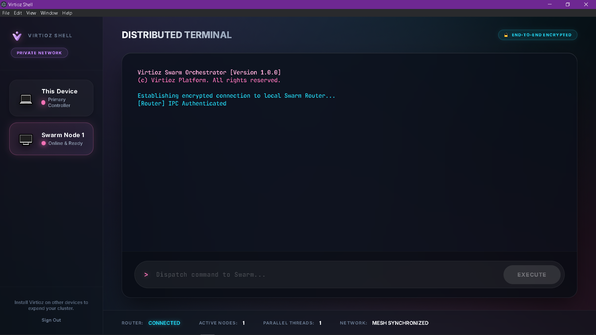
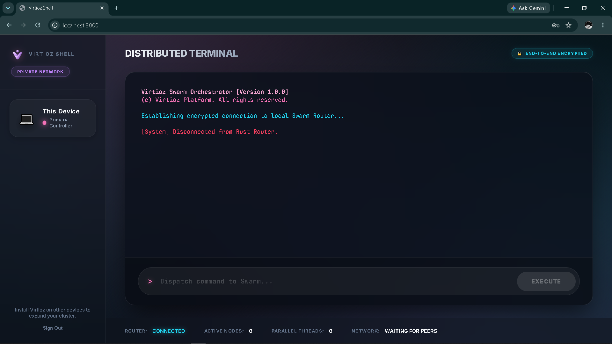

<div align="center">
  
  <h1>Virtioz Swarm Orchestrator</h1>
  <p>A high-performance, decentralized mesh architecture for distributed agent execution.</p>
</div>

---

## 🌌 Overview
Virtioz is a next-generation decentralized platform designed to orchestrate and execute terminal commands and AI agent workloads across a secure mesh network. 

## 🖥 Interface

### Electron Desktop Application


### Chrome Web Application


### Command Execution Demonstrations


## 🏗 Architecture
The platform is built with a dual-stack architecture to maximize performance and cross-platform compatibility:

- **Core (Rust)**: A blazing-fast, concurrent backend utilizing `tokio` for async networking and WebRTC for peer-to-peer signaling. It acts as the intelligent load balancer and task router for the Swarm.
  - `virtioz-signaling`: WebRTC Mesh Signaling Server.
  - `virtioz-agent`: The Swarm Node worker that executes payloads.
  - `virtioz-router`: The core orchestrator that manages websocket streams to the UI.
- **Shell (React + Electron)**: A stunning, glassmorphism-styled decentralized terminal interface running on desktop and web, providing real-time streaming feedback of Swarm execution.

## 🚀 Quick Start

### Prerequisites
- [Node.js](https://nodejs.org/) (v18+)
- [Rust & Cargo](https://rustup.rs/)

### Setup
1. Clone the repository:
   ```bash
   git clone https://github.com/virtioz/virtioz-platform.git
   cd virtioz-platform
   ```

2. Install Shell Dependencies:
   ```bash
   cd shell
   npm install
   cd ..
   ```

3. Configure Environment:
   ```bash
   cp shell/.env.example shell/.env
   # Add your Supabase credentials to the .env file
   ```

4. Boot the Swarm:
   ```bash
   npm run virtioz
   ```
   *This command automatically compiles the Rust Core, boots the mesh servers, and launches the Electron application in a perfectly synchronized sequence.*

## 🔒 Security
- **Mesh Encryption**: All P2P traffic between Swarm Agents is encrypted.
- **IPC Auth**: Local inter-process communication is secured with token validation.
- **Data Isolation**: Context is fully isolated in standard desktop environments using Electron `contextIsolation: true`.

## 📄 License
(c) Virtioz Platform. All rights reserved.
